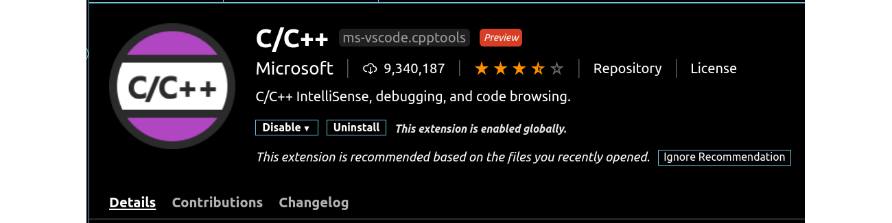

# Visual Code

Visual Studio Code is a lightweight but powerful source code editor which runs on your desktop and is available for Windows, macOS and Linux. It comes with built-in support for JavaScript, TypeScript and Node.js and has a rich ecosystem of extensions for other languages and runtimes (such as C++, C#, Java, Python, PHP, Go, .NET). 

## Installation

Google for `visual code` or navigate to [https://code.visualstudio.com/](https://code.visualstudio.com/).

Hit the `Download for Windows` button and wait for the installer to download and then start it.

Select both `Add Open with Code ...` options.

Install the VSCode `C/C++ Extension` which will provide some extra functionality.

::: tip Tip - Other Useful Extensions
Some other useful extensions for Visual Studio Code include:

* [Code Spell Checker](https://marketplace.visualstudio.com/items?itemName=streetsidesoftware.code-spell-checker): a spell checker that works well with code
* [Bracket Pair Colorizer](https://marketplace.visualstudio.com/items?itemName=CoenraadS.bracket-pair-colorizer): a customizable extension for colorizing matching brackets
:::

