# C++ Compiler - MinGW

The C++ compiler will allow you to compile C++ source code into a binary that can be executed on your system.
As a compiler you can make use of **MinGW** which stands for "Minimalist GNU for Windows", which is a native Windows port of the GNU Compiler Collection (GCC).

::: tip GNU
GNU is an operating system and an extensive collection of computer software. **GNU is composed wholly of free software**, most of which is licensed under GNU's own GPL (General Purpose License). GNU is a recursive acronym for "GNU's Not Unix!", chosen because GNU's design is Unix-like, but differs from Unix by being free software and containing no Unix code. The GNU project includes an operating system kernel, GNU HURD, which was the original focus of the Free Software Foundation (FSF). However, non-GNU kernels, most famously Linux, can also be used with GNU software; and since the kernel is the least mature part of GNU, this is how it is usually used. The combination of GNU software and the Linux kernel is commonly known as GNU/Linux.
:::

MinGW can be downloaded at [https://sourceforge.net/projects/mingw/](https://sourceforge.net/projects/mingw/).

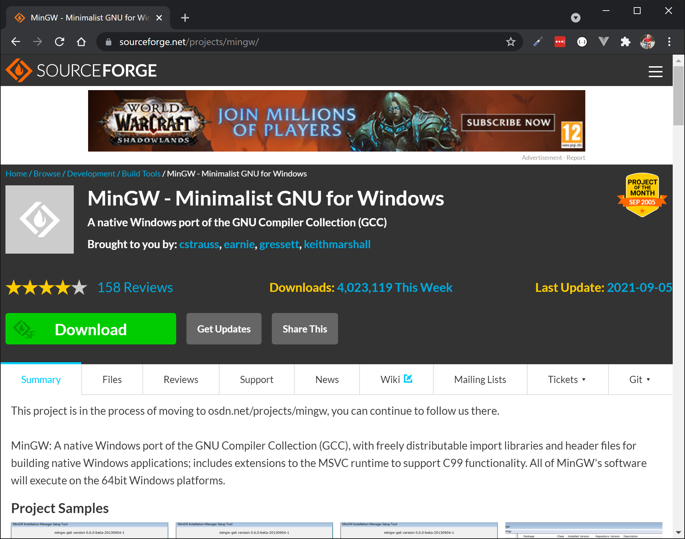

Navigate to `Downloads` and allow `mingw-get-setup.exe` to download.

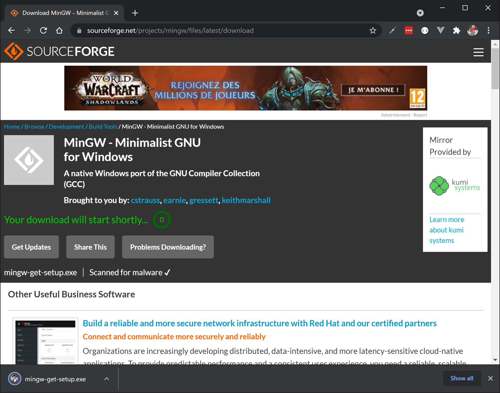

Launch the installer and accept the license to continue.

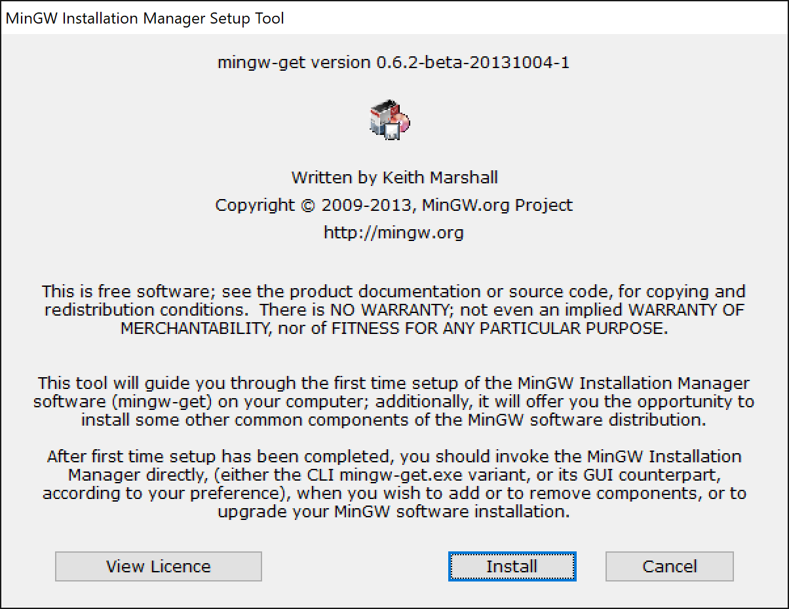

Keep the installation directory to its default setting.

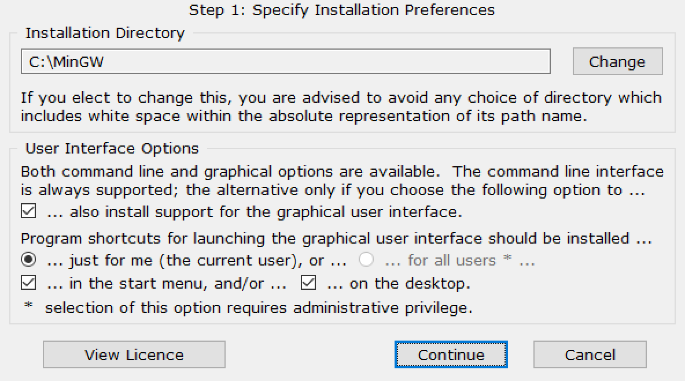

Wait for the installer to finish. Then click `Continue`.

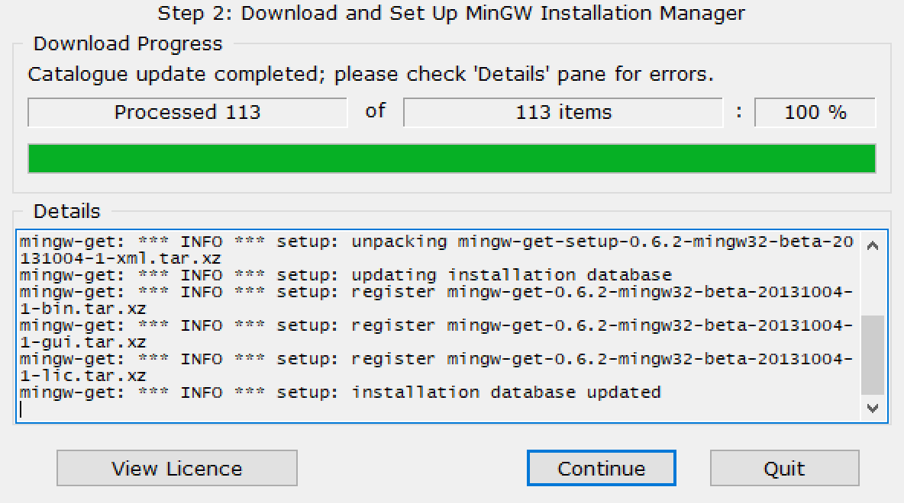

Now the *Installation Manager* will open and allow you to install the required packages. Make sure to select the following packages from the `Basic Setup` category:

* `mingw32-base`
* `mingw32-gcc-g++`

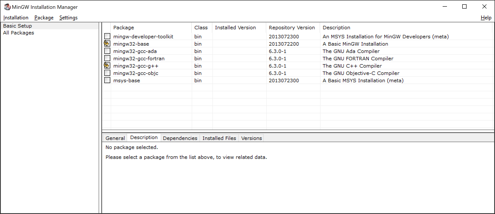

Next hit `Installation => Apply Changes` and click `Apply` in the confirmation dialog.

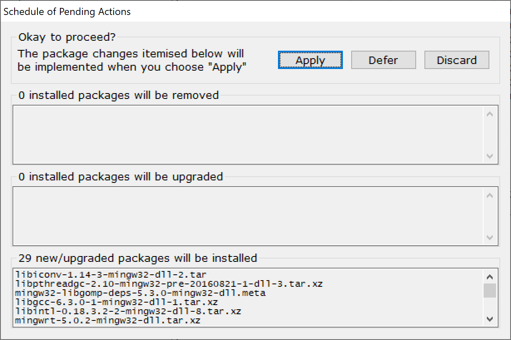

Now wait for the packages to install.

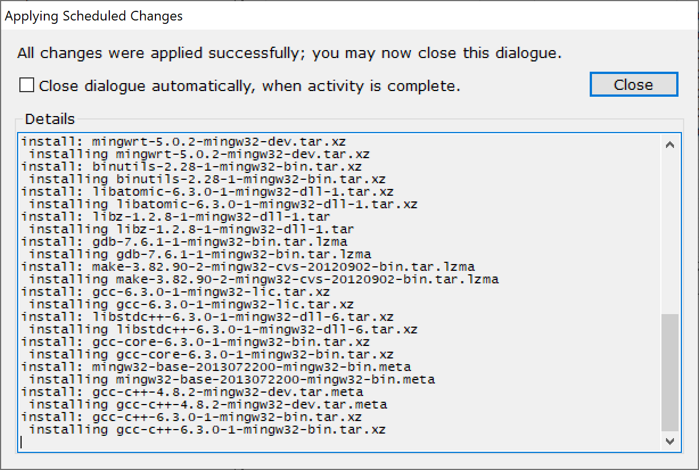

The end result should be the same as shown in the next screenshot.

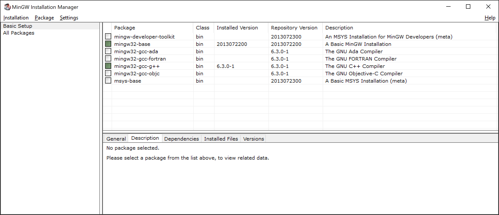

## Adding to PATH environment

Next you will need to add the `bin` directory of MinGW to your environment path on Windows. Right click `My Computer` and hit `Properties`.

Now navigate to `Advanced System settings => Advanced => Environment Variables => User variables`. Select the `Path` variable and hit `Edit`. Now create a `New` entry and choose `Browse`. Select the `bin` directory where you installed MinGW, standard this should be `C:\MinGW\bin`.

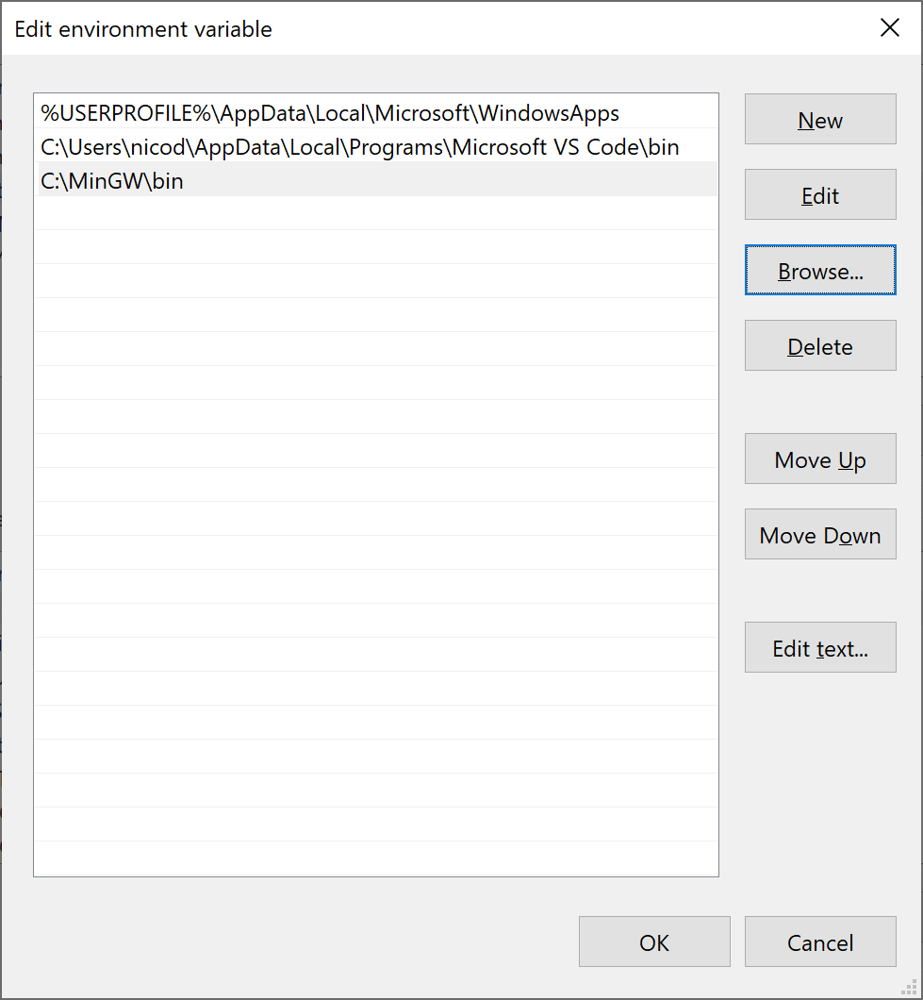

## Check

To check if all is working as needed, open up a PowerShell window and issue the following command:

```bash
g++ --version
```

It should display the version of your C++ compiler.

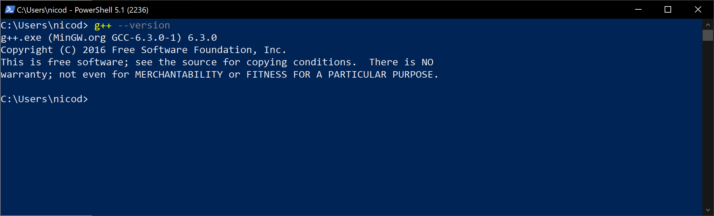

